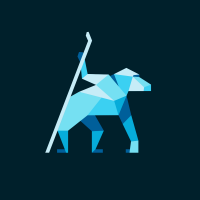

# generator-angular-require-fullstack [](https://travis-ci.org/monits/generator-angular-require-fullstack)

> [Yeoman](http://yeoman.io) generator

## Getting Started

### What is Yeoman?

Trick question. It's not a thing. It's this guy:

Basically, he wears a top hat, lives in your computer, and waits for you to tell him what kind of application you wish to create.

Not every new computer comes with a Yeoman pre-installed. He lives in the [npm](https://npmjs.org) package repository. You only have to ask for him once, then he packs up and moves into your hard drive. *Make sure you clean up, he likes new and shiny things.*

```bash
npm install -g yo
```
### Yeoman Generators

Yeoman travels light. He didn't pack any generators when he moved in. You can think of a generator like a plug-in. You get to choose what type of application you wish to create, such as a Backbone application or even a Chrome extension.

### Generator info

The Angular Require Fullstack generator comes to speed up the scaffolding of projects using both AngularJS and RequireJS alongside with some must-have tools/plugins like file revving, i18n, minification of images and files among others. 

####Why do we need a generator at all?
Well, unless you like spending time creating the basic structure for each project you start, setting up its configuration and the tools/plugins/frameworks you're going to use, you will agree that those tasks are terrible repetitive, tough, long and on top of that, they have a ROI tending to zero. Using a generator will simplify most of these tasks in seconds.

####Why to use this generator?
We believe that both AngularJS and RequireJS are extremely usefull when building up web applications, and we wanted to use both of them on all of the web projects we develop, but we couldn't find a generator that did these while providing support to file revving and i18n, which we think must be present in any decent web application. 

####Who built this generator?
This generator was built by Monits. If you'd like to know more about Monits, go to [Monits](http://www.monits.com) or check out our [Blog](https://medium.com/monits-blog)



### How to use it

To install generator-angular-require-fullstack from npm, run:

```bash
npm install -g generator-angular-require-fullstack
```

Finally, initiate the generator:

```bash
yo angular-require-fullstack
```
It will guide you from there

### Getting To Know Yeoman

Yeoman has a heart of gold. He's a person with feelings and opinions, but he's very easy to work with. If you think he's too opinionated, he can be easily convinced.

If you'd like to get to know Yeoman better and meet some of his friends, [Grunt](http://gruntjs.com) and [Bower](http://bower.io), check out the complete [Getting Started Guide](https://github.com/yeoman/yeoman/wiki/Getting-Started).

## License

MIT
